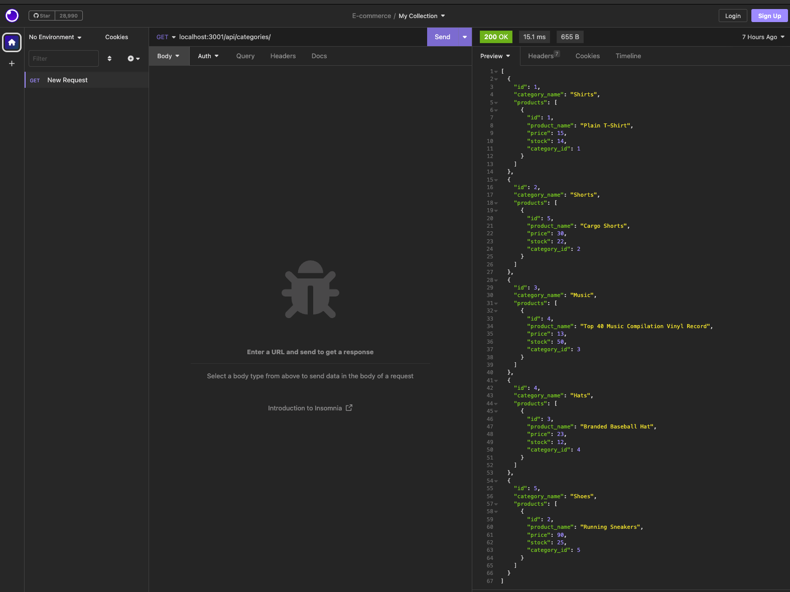
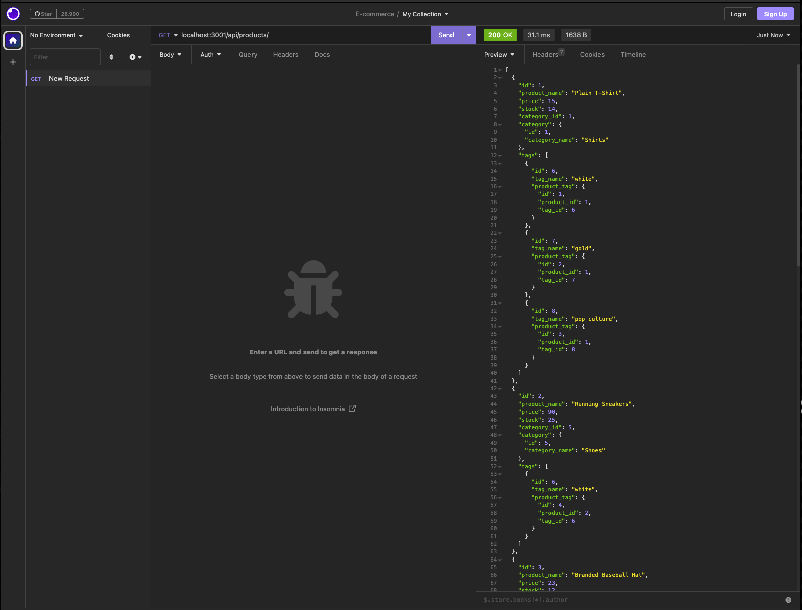
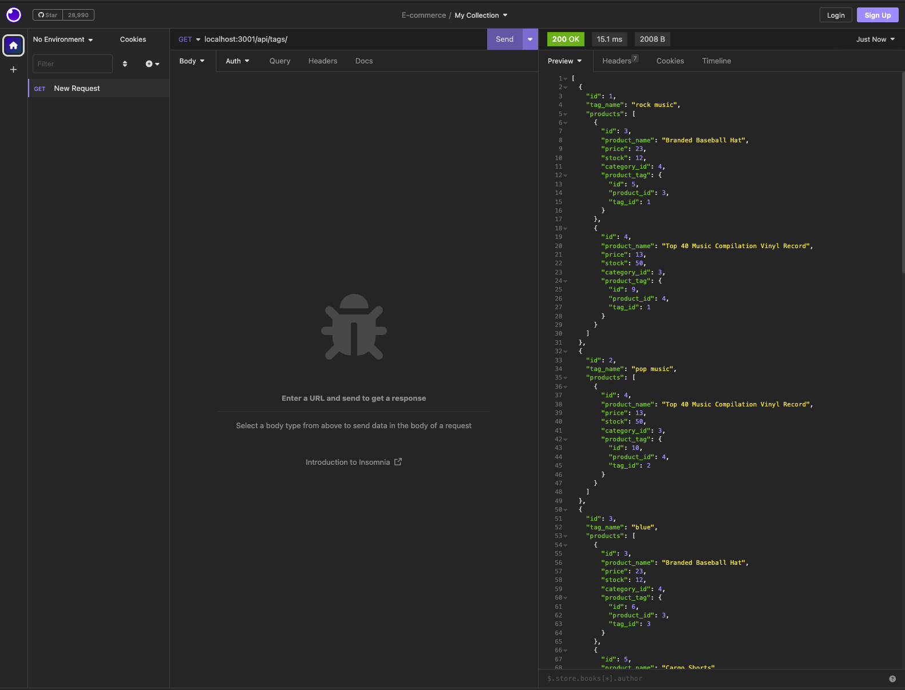

# E-commerce
## Description
To build the back end for an e-commerce site. It will take a working Express.js API and configure it to use Sequelize to interact with a MySQL database.

## Table of Contents
* [Installation](#installation)
* [Usage](#usage)
* [Contributors](#Contributors)
* [Link](#link)
* [License](#license)

## Installation
Mysql2 and sequelize, express, dontev. Also show the POST, PUT, and DELETE routes for products and tags being tested in Insomnia Core.

## Usage
1.Added my database name, MySQL username, and MySQL password to an environment variable file then to be able to connect to a database using Sequelize

2.Enter schema and seed commands, then a development database is created and is seeded with test data

3.Enter the command to invoke the application, then my server is started and the Sequelize models are synced to the MySQL database

3.Open API GET routes in Insomnia Core for categories, products, or tags

4.Test API POST, PUT, and DELETE routes in Insomnia Core, then to be able to successfully create, update, and delete data in my database

## Contributors
Starter code: Xandromus, Georgeyoo

## Link
[Github repository](https://github.com/Shok1to/E-commerce)

[E-commerce video demo](https://drive.google.com/file/d/1EnwDWaQNkYyFAJbL0f5xA-krUPKYLbdZ/view)

## License

